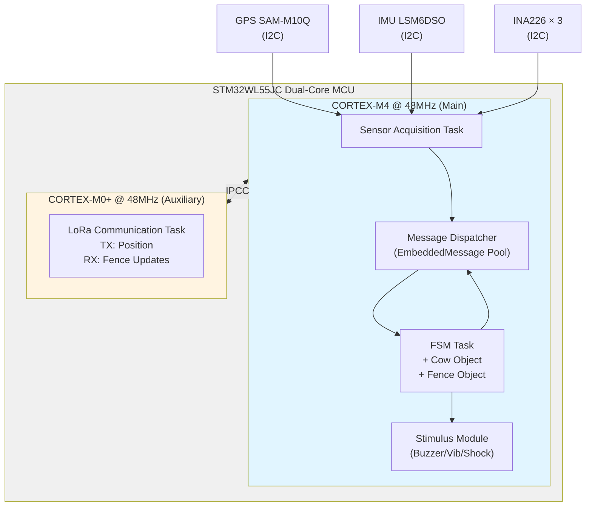
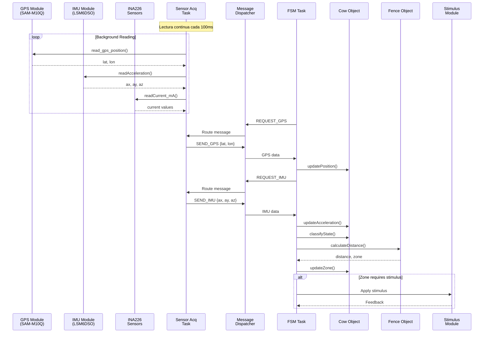
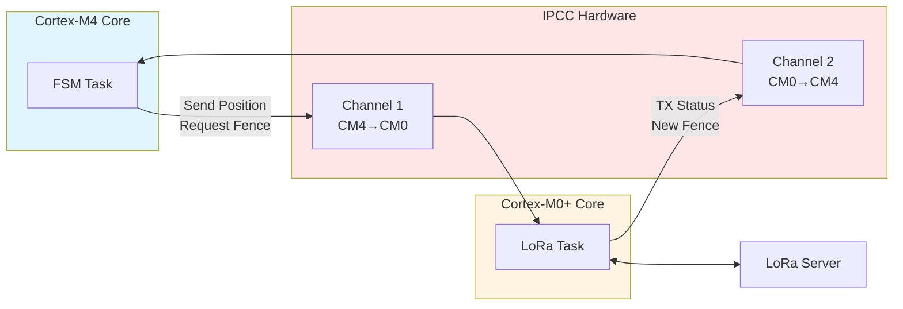

# TPP-IntelliFence - System Overview

## 🎯 Visión General del Proyecto

TPP-IntelliFence es un sistema de cerco virtual inteligente para ganado bovino basado en el microcontrolador **STM32WL55JC** (dual-core Cortex-M4 + Cortex-M0+). El sistema utiliza GPS para rastrear la posición de los animales y aplica estímulos progresivos cuando se acercan o cruzan los límites del cerco virtual.

---

## 🏗️ Arquitectura del Sistema

### Hardware Platform
- **MCU**: STM32WL55JC (Dual-Core)
  - **CM4** (Cortex-M4 @ 48MHz): Core principal - FSM, sensores, procesamiento
  - **CM0+** (Cortex-M0+ @ 48MHz): Core auxiliar - LoRa comunicación
- **Comunicación Inter-Core**: IPCC (Inter-Processor Communication Controller)
- **RTOS**: FreeRTOS con scheduler preemptivo

### Sensores Integrados

#### 📡 GPS SAM-M10Q
- **Interfaz**: UART (USART1)
- **Protocolos**: NMEA 0183 y UBX
- **Baudrate**: 9600 - 115200 bps configurable
- **Precisión**: ~2.5m CEP
- **Función**: Posicionamiento absoluto de la vaca

#### ⚡ INA226 (Power Monitor)
- **Interfaz**: I2C thread-safe
- **Direcciones**: 0x40, 0x41, 0x45 (multi-sensor)
- **Función**: Monitoreo de corriente/voltaje/potencia del sistema
- **Resolución**: 16-bit ADC

#### 🎯 LSM6DSO (IMU 6DOF)
- **Interfaz**: I2C thread-safe
- **Función**: Acelerómetro + Giroscopio
- **Uso**: Clasificación de estado de la vaca (SLEEP, GRAZING, MOVEMENT)
- **Rangos**: ±2/±4/±8/±16g (accel), ±250/±500/±1000/±2000dps (gyro)

---

## 🔄 Flujo de Datos del Sistema

### Vista de Alto Nivel: Arquitectura Dual-Core



### Flujo Detallado de Datos en CM4



### Comunicación Inter-Core (IPCC)



---

## 🧩 Componentes Principales

### 1. **Cow Class** (Modelo de Datos)
Representa el estado completo de la vaca en tiempo real:
```cpp
class Cow {
    DeviceUID uid;          // Identificador único del dispositivo
    Position position;      // Latitud/Longitud (GPS)
    Acceleration accel;     // ax, ay, az (IMU)
    CowState state;         // SLEEP, GRAZING, MOVEMENT
    zone_t currentZone;     // GREEN, BLUE, YELLOW, RED, BLACK
    float distanceToLimit;  // Distancia al límite más cercano (m)
};
```

### 2. **Fence Class** (Cerco Virtual)
Implementación embedded-friendly del polígono de cerca:
```cpp
class Fence {
    Vertex vertices[MAX_VERTICES];  // Vértices del polígono (máx 20)
    Line limits[MAX_LIMITS];        // Líneas calculadas
    uint8_t vertexCount;
    uint8_t limitCount;
    Position center;                // Centro geométrico
};
```

### 3. **EmbeddedMessage System** (Mensajería)
Sistema de mensajes pool-based para comunicación inter-task:
```cpp
typedef struct {
    uint8_t id;                     // Identificador del mensaje
    ModuleId_t source;              // Módulo origen
    ModuleId_t dest;                // Módulo destino
    uint8_t payload[MAX_PAYLOAD];   // Datos (64 bytes)
    uint8_t length;                 // Tamaño del payload
} EmbeddedMessage_t;
```

### 4. **FSM (Finite State Machine)**
Máquina de estados principal con 3 FSMs principales:
- **STARTUP_ROUTINE**: Inicialización, obtención de GPS inicial, recepción de cerca
- **NORMAL_OPERATION**: Operación normal con sub-FSMs (INITIALIZE, GREEN_ZONE, STIMULUS_ZONE)
- **FENCE_TRANSITION**: Actualización de cerca virtual recibida por LoRa

---

## 📊 Stack de Software

### Sistema Operativo
- **FreeRTOS v10.x** con scheduler preemptivo
- **Tasks principales**:
  - `fsmTask` - Máquina de estados principal (Priority: Normal)
  - `sensorAcqTask` - Adquisición de sensores (Priority: Normal)
  - `dispatcherTask` - Despacho de mensajes (Priority: High)
  - `loraTask` - Comunicación LoRa (CM0+)

### Drivers y HAL
- **STM32 HAL** (Hardware Abstraction Layer)
- **CMSIS-RTOS** v2
- **Thread-Safe Wrappers**: I2C Manager, UART GPS

### Utilidades
- **RTOS Printf**: Sistema de logging thread-safe
- **Message Pool**: Gestión de memoria dinámica sin fragmentación
- **I2C Manager**: Arbitraje de bus I2C entre sensores

---

## 🌐 Comunicación LoRa

### Protocolo
- **Frecuencia**: 915 MHz (región Americas)
- **Modulación**: LoRa (Chirp Spread Spectrum)
- **Potencia TX**: Configurable hasta +22 dBm

### Mensajes
#### TX (Vaca → Servidor)
- Posición GPS (lat/lon)
- Estado de batería
- Eventos críticos (escape de cerca)

#### RX (Servidor → Vaca)
- Actualización de cerca virtual (vertices)
- Comandos de configuración
- Ajustes de zonas de estímulo

---

## 🔋 Gestión de Energía

### Modos de Operación
1. **Active Mode**: GPS + IMU + Processing (consumo ~50-100 mA)
2. **Low Power Sleep**: Suspende GPS, conserva RTOS (~5-10 mA)
3. **Deep Sleep**: Shutdown total excepto RTC (~1-2 µA)

### Estrategias
- **GPS Rate Adaptativo**:
  - `STOP`: Vaca dormida (sin GPS)
  - `SLOW`: Vaca pastando en zona verde (60s)
  - `MEDIUM`: Vaca en movimiento lejos del límite (30s)
  - `FAST`: Vaca cerca del límite (10s)

---

## 🎯 Zonas de Estímulo

| Zona | Color | Distancia | Estímulo |
|------|-------|-----------|----------|
| **GREEN** | Verde | Dentro del cerco | Sin estímulo |
| **LIGHT_BLUE** | Azul Claro | ~15m del límite | Buzzer suave |
| **BLUE** | Azul | ~10m del límite | Buzzer medio |
| **DARK_BLUE** | Azul Oscuro | ~5m del límite | Buzzer intenso |
| **YELLOW** | Amarillo | ~2m del límite | Buzzer + Vibración |
| **RED** | Rojo | En el límite | Vibración intensa |
| **BLACK** | Negro | Fuera del cerco | Alerta crítica (escape) |

---

## 🔧 Configuración del Sistema

### Constantes Principales
```cpp
#define MAX_VERTICES      20        // Máximo de vértices del cerco
#define MAX_MESSAGE_POOL  16        // Pool de mensajes
#define NEAR_LIMIT        10.0f     // Distancia "cerca" del límite (m)
#define MAX_TRIES         10        // Reintentos de operaciones
```

### Prioridades de Tasks
```cpp
#define FSM_TASK_PRIORITY           2  // Normal
#define SENSOR_ACQ_TASK_PRIORITY    2  // Normal
#define DISPATCHER_TASK_PRIORITY    3  // Alta
#define LORA_TASK_PRIORITY          2  // Normal
```

---

## 📁 Estructura de Directorios del Código

```
CM4/Core/
├── Inc/
│   ├── cow.h                    # Clase Cow
│   ├── fence.h                  # Clase Fence
│   ├── zone.h                   # Definición de zonas
│   ├── EmbeddedMessage.h        # Sistema de mensajería
│   └── Threads/
│       └── fsmTask.h            # FSM principal
├── Src/
│   ├── main.c                   # Entry point + RTOS init
│   ├── cow.cpp                  # Implementación Cow
│   ├── fence.cpp                # Implementación Fence
│   ├── EmbeddedMessage.c        # Message pool
│   └── Threads/
│       └── fsmTask.cpp          # FSM implementation
└── Modules/
    ├── GPS/                     # SAM-M10Q driver
    ├── IMU/                     # LSM6DSO driver
    ├── INA/                     # INA226 driver
    └── I2C/                     # I2C Manager thread-safe
```

---

## 🚀 Getting Started

1. **Configurar entorno**: Ver README.md en raíz del proyecto
2. **Compilar**: `cmake --preset Debug && cmake --build build/Debug`
3. **Flash**: Usar STM32CubeProgrammer o debugger
4. **Tests**: Ejecutar tests individuales modificando `main.c`

---

## 📖 Documentación Relacionada

- [FSM Architecture](02_fsm_architecture.md) - Detalles de la máquina de estados
- [Messaging System](03_messaging_system.md) - Sistema de mensajería pool-based
- [Cow Class](04_cow_class.md) - Modelo de datos de la vaca
- [Fence Class](05_fence_class.md) - Implementación del cerco virtual

---

**Última actualización**: 22 de Noviembre de 2025  
**Versión**: v1.0
