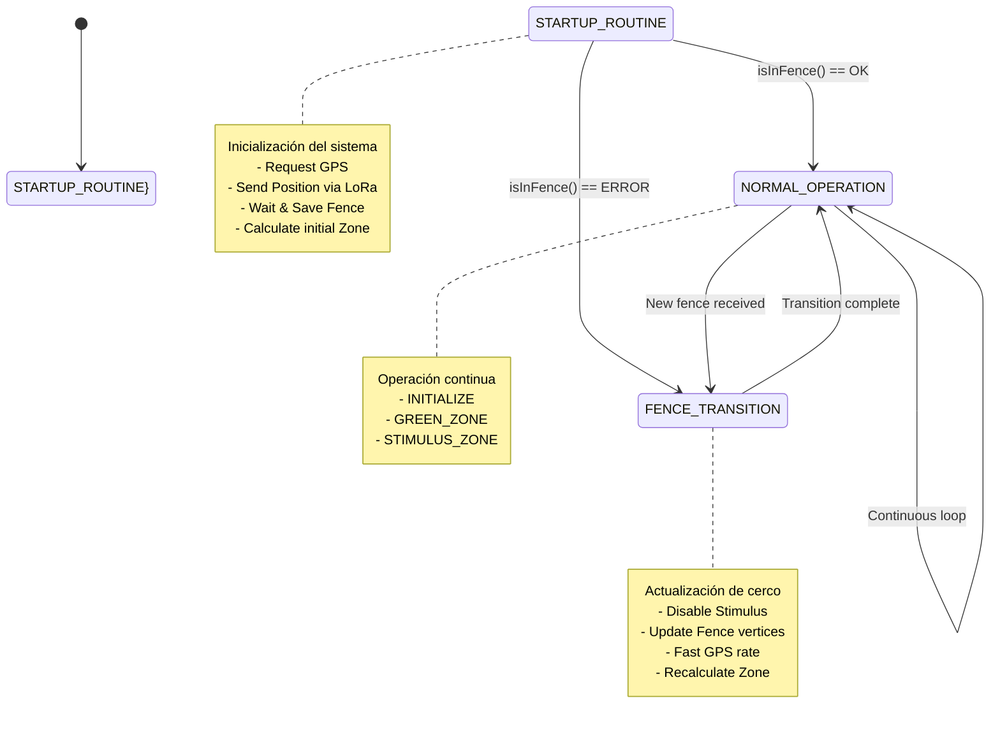
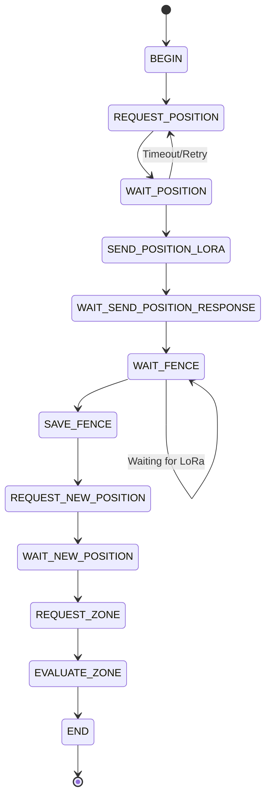
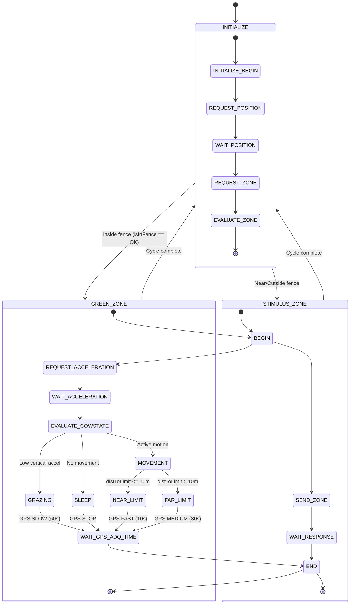
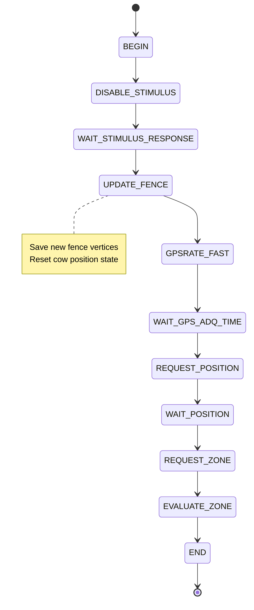
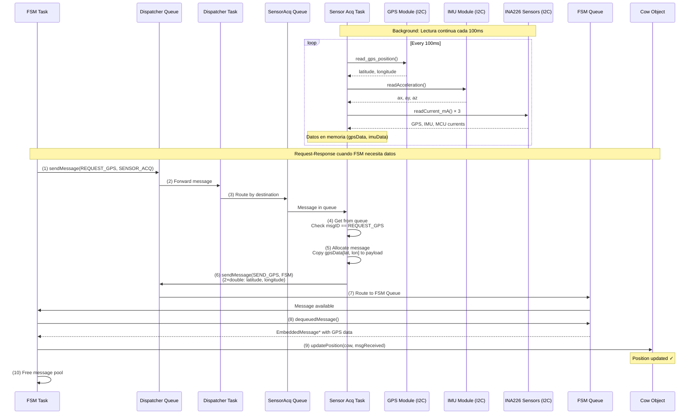
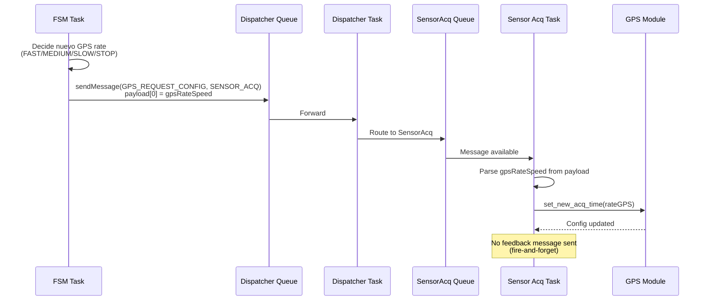
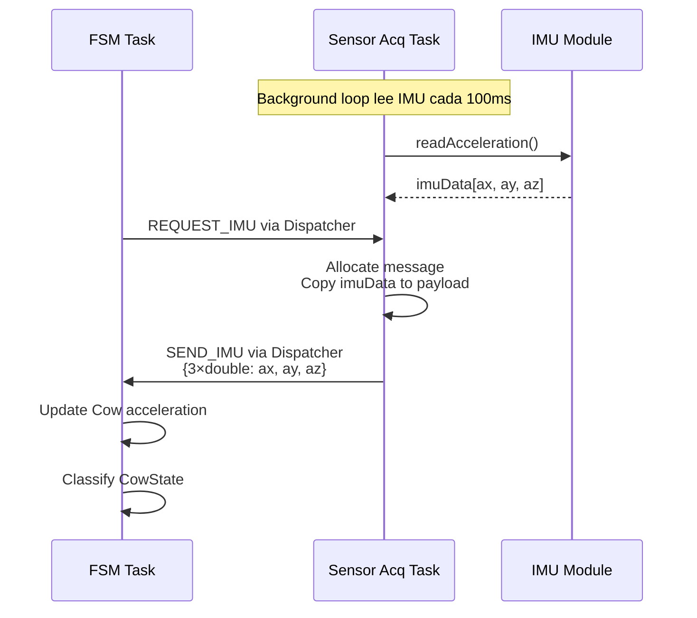
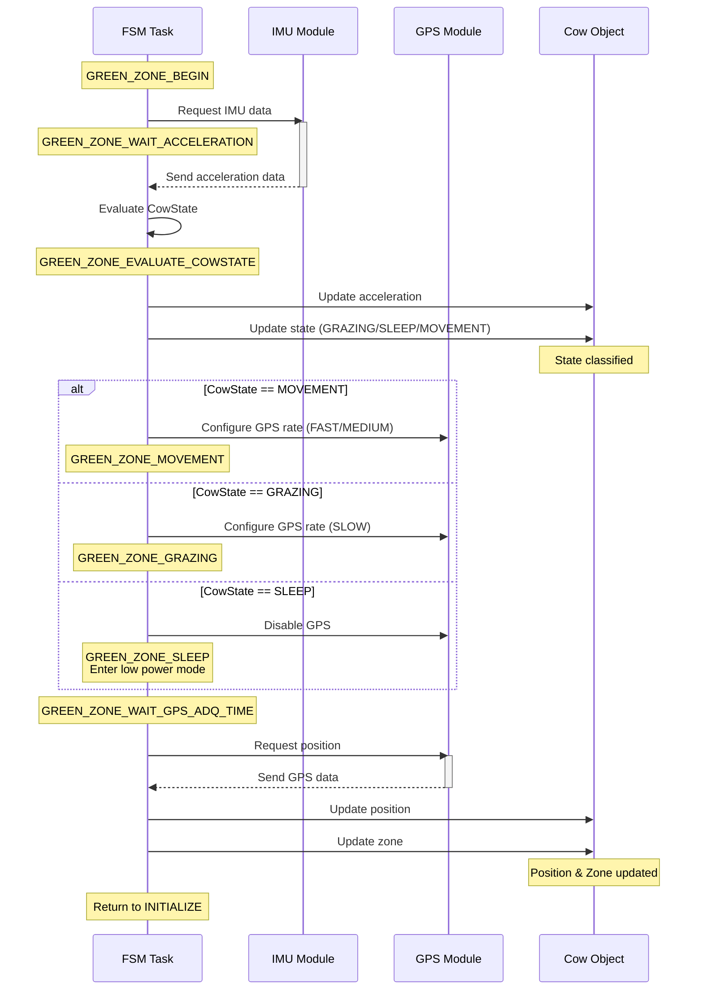

# TPP-IntelliFence - FSM Architecture

## 🎯 Visión General

La **Finite State Machine (FSM)** es el núcleo del sistema TPP-IntelliFence. Implementa la lógica de control que coordina todos los módulos (GPS, IMU, LoRa, Stimulus) basándose en el estado actual de la vaca y su posición relativa al cerco virtual.

---

## 🏗️ Arquitectura de la FSM

### Jerarquía de Estados - Vista General

**Diagrama principal mostrando los 3 estados principales del sistema:**



### Desglose Detallado de Sub-Estados

#### Sub-estados de STARTUP_ROUTINE



#### Sub-estados de NORMAL_OPERATION



#### Sub-estados de FENCE_TRANSITION



---

## 📊 Estados Principales

### 1. STARTUP_ROUTINE

**Propósito**: Inicialización del sistema al encendido.

**Sub-estados**:
```cpp
typedef enum {
    STARTUP_ROUTINE_BEGIN,
    STARTUP_ROUTINE_REQUEST_POSITION,      // Solicitar GPS inicial
    STARTUP_ROUTINE_WAIT_POSITION,         // Esperar respuesta GPS
    STARTUP_ROUTINE_SEND_POSITION_LORA,    // Enviar posición al servidor
    STARTUP_ROUTINE_WAIT_SEND_POSITION_RESPONSE,
    STARTUP_ROUTINE_WAIT_FENCE,            // Esperar cerca virtual
    STARTUP_ROUTINE_SAVE_FENCE,            // Guardar vértices del cerco
    STARTUP_ROUTINE_REQUEST_NEW_POSITION,  // GPS actualizado
    STARTUP_ROUTINE_WAIT_NEW_POSITION,
    STARTUP_ROUTINE_REQUEST_ZONE,          // Calcular zona inicial
    STARTUP_ROUTINE_EVALUATE_ZONE,         // Evaluar si está dentro
    STARTUP_ROUTINE_END
} StartupRoutineState_t;
```

**Flujo**:
1. Solicita posición GPS inicial
2. Envía posición al servidor LoRa
3. Espera recepción de vértices del cerco virtual
4. Guarda el cerco en memoria (Fence class)
5. Actualiza GPS nuevamente
6. Calcula zona actual (GREEN/RED/BLACK)
7. Transiciona a NORMAL_OPERATION o FENCE_TRANSITION

**Condición de salida**:
```cpp
if (isInFence(cow) == HAL_OK) {
    mainFSM = MainFSM_t::NORMAL_OPERATION;
} else {
    mainFSM = MainFSM_t::FENCE_TRANSITION;
}
```

---

### 2. NORMAL_OPERATION

**Propósito**: Operación continua cuando la vaca está dentro del cerco.

**Sub-FSMs**:

#### 2.1 INITIALIZE
```cpp
typedef enum {
    INITIALIZE_BEGIN,
    INITIALIZE_REQUEST_POSITION,
    INITIALIZE_WAIT_POSITION,
    INITIALIZE_REQUEST_ZONE,
    INITIALIZE_EVALUATE_ZONE,
    INITIALIZE_END
} InitializeState_t;
```

**Función**: 
- Obtiene posición GPS actual
- Calcula distancia al límite
- Determina zona (GREEN vs STIMULUS)

**Transición**:
- Si `isInFence()` → GREEN_ZONE
- Si `!isInFence()` → STIMULUS_ZONE

---

#### 2.2 GREEN_ZONE
```cpp
typedef enum {
    GREEN_ZONE_BEGIN,
    GREEN_ZONE_REQUEST_ACCELERATION,    // Solicitar datos IMU
    GREEN_ZONE_WAIT_ACCELERATION,       // Esperar aceleración
    GREEN_ZONE_EVALUATE_COWSTATE,       // Clasificar estado
    GREEN_ZONE_GRAZING,                 // GPS lento (pastando)
    GREEN_ZONE_SLEEP,                   // GPS stop (dormida)
    GREEN_ZONE_MOVEMENT,                // Vaca en movimiento
    GREEN_ZONE_NEAR_LIMIT,              // Cerca del límite (GPS rápido)
    GREEN_ZONE_FAR_LIMIT,               // Lejos del límite (GPS medio)
    GREEN_ZONE_WAIT_GPS_ADQ_TIME,       // Esperar tiempo de adquisición
    GREEN_ZONE_END
} GreenZoneState_t;
```

**Lógica de GPS Rate Adaptativo**:
```cpp
switch (cow.getState()) {
    case CowState::GRAZING:
        updateGpsAdqTime(GpsRate::SLOW);   // 60s
        break;
    case CowState::SLEEP:
        updateGpsAdqTime(GpsRate::STOP);   // GPS off
        enterLowPowerSleep();
        break;
    case CowState::MOVEMENT:
        if (cow.getDistanceToLimit() <= NEAR_LIMIT) {
            updateGpsAdqTime(GpsRate::FAST);   // 10s
        } else {
            updateGpsAdqTime(GpsRate::MEDIUM); // 30s
        }
        break;
}
```

**Clasificación de Estado**:
```cpp
static CowState classifyMotion(Acceleration acc) {
    double abs_ax = fabs(acc.ax);
    double abs_ay = fabs(acc.ay);
    double abs_az = fabs(acc.az);
    
    if (abs_ax < 0.05 && abs_ay < 0.05 && abs_az < 0.05)
        return CowState::SLEEP;      // Sin movimiento
    else if (abs_ax < 0.05 && abs_ay < 0.05 && abs_az > 0.1)
        return CowState::GRAZING;    // Cabeza hacia abajo
    else
        return CowState::MOVEMENT;   // Movimiento activo
}
```

---

#### 2.3 STIMULUS_ZONE
```cpp
typedef enum {
    STIMULUS_ZONE_BEGIN,
    STIMULUS_ZONE_SEND_ZONE,        // Enviar zona al módulo stimulus
    STIMULUS_ZONE_WAIT_RESPONSE,    // Esperar confirmación
    STIMULUS_ZONE_END
} StimulusZone_t;
```

**Función**:
- Envía zona actual (BLUE/YELLOW/RED) al módulo de estímulos
- Espera confirmación de que el estímulo fue aplicado
- Vuelve a INITIALIZE para recalcular posición

**Zonas de estímulo**:
```cpp
typedef enum {
    GREEN_ZONE       = 0x00,  // Dentro del cerco (sin estímulo)
    LIGHT_BLUE_ZONE  = 0x01,  // Buzzer leve
    BLUE_ZONE        = 0x02,  // Buzzer medio
    DARK_BLUE_ZONE   = 0x03,  // Buzzer intenso
    YELLOW_ZONE      = 0x04,  // Buzzer + vibración
    RED_ZONE         = 0x05,  // Vibración intensa
    BLACK_ZONE       = 0x06   // Escapó (alerta crítica)
} zone_t;
```

---

### 3. FENCE_TRANSITION

**Propósito**: Actualizar el cerco virtual cuando se recibe uno nuevo por LoRa.

**Sub-estados**:
```cpp
typedef enum {
    FENCE_TRANSITION_BEGIN,
    FENCE_TRANSITION_DISABLE_STIMULUS,          // Desactivar estímulos
    FENCE_TRANSITION_WAIT_STIMULUS_RESPONSE,
    FENCE_TRANSITION_UPDATE_FENCE,              // Guardar nuevo cerco
    FENCE_TRANSITION_GPSRATE_FAST,              // GPS rápido durante transición
    FENCE_TRANSITION_WAIT_GPS_ADQ_TIME,
    FENCE_TRANSITION_REQUEST_POSITION,
    FENCE_TRANSITION_WAIT_POSITION,
    FENCE_TRANSITION_REQUEST_ZONE,
    FENCE_TRANSITION_EVALUATE_ZONE,
    FENCE_TRANSITION_END
} FenceTransitionState_t;
```

**Flujo**:
1. Desactiva todos los estímulos (zona BLACK)
2. Actualiza el objeto Fence con nuevos vértices
3. Configura GPS en modo FAST
4. Obtiene posición actualizada
5. Recalcula zona con nuevo cerco
6. Vuelve a NORMAL_OPERATION

---

## 🔄 Mensajería Entre Módulos

### Message IDs Principales

```cpp
// Control General
#define MSG_ID_START                          0x01
#define MSG_ID_STOP                           0x02
#define MSG_ID_RESET                          0x03
#define MSG_ID_ACK                            0x04

// Estado y Sincronización
#define MSG_ID_STATE_UPDATE                   0x10
#define MSG_ID_STATUS_REQUEST                 0x11
#define MSG_ID_STATUS_RESPONSE                0x12
#define MSG_ID_TIME_SYNC                      0x13

// Sensor Acquisition - Responses
#define MSG_ID_SEND_GPS                       0x20
#define MSG_ID_SEND_IMU                       0x21
#define MSG_ID_SEND_INA_MCU                   0x22
#define MSG_ID_SEND_INA_GPS                   0x23
#define MSG_ID_SEND_INA_IMU                   0x24

// Sensor Acquisition - Requests
#define MSG_ID_REQUEST_GPS                    0x25
#define MSG_ID_REQUEST_IMU                    0x26
#define MSG_ID_REQUEST_INA_MCU                0x27
#define MSG_ID_REQUEST_INA_GPS                0x28
#define MSG_ID_REQUEST_INA_IMU                0x29

// Fence & Zone Messages
#define MSG_ID_FENCE_UPDATE                   0x30
#define MSG_ID_FENCE_STATUS                   0x31
#define MSG_ID_FENCE_BREACH                   0x32
#define MSG_ID_REQUEST_DISTANCE_TO_FENCE      0x33
#define MSG_ID_REQUEST_ZONE_TO_FENCE          0x34
#define MSG_ID_REQUEST_ZONE_AND_DISTANCE_TO_FENCE 0x35
#define MSG_ID_SEND_DISTANCE_TO_FENCE         0x36
#define MSG_ID_SEND_ZONE_TO_FENCE             0x37
#define MSG_ID_SEND_ZONE_AND_DISTANCE_TO_FENCE 0x38

// Stimulus Messages
#define MSG_ID_ZONE_CHANGE                    0x40
#define MSG_ID_STIMULUS_FEEDBACK              0x41
#define MSG_ID_STIMULUS_VIBRATION_REQUEST     0x42
#define MSG_ID_STIMULUS_VIBRATION_FEEDBACK    0x43
#define MSG_ID_STIMULUS_SOUND_REQUEST         0x44
#define MSG_ID_STIMULUS_SOUND_FEEDBACK        0x45
#define MSG_ID_STIMULUS_ELECTRIC_REQUEST      0x46
#define MSG_ID_STIMULUS_ELECTRIC_FEEDBACK     0x47

// Sensor Data
#define MSG_ID_SENSOR_DATA                    0x50

// LoRa Messages
#define MSG_ID_LORA_TX                        0x60
#define MSG_ID_LORA_RX                        0x61
#define MSG_ID_LORA_JOINED                    0x62
#define MSG_ID_LORA_SEND_POSITION             0x63
#define MSG_ID_LORA_SEND_POSITION_FEEDBACK    0x64
#define MSG_ID_LORA_VERTEXES_RECEIVED         0x65

// GPS Configuration
#define MSG_ID_GPS_REQUEST_CONFIG             0x70
#define MSG_ID_GPS_CONFIG_RESPONSE            0x71

// System Messages
#define MSG_ID_ERROR                          0xF0
#define MSG_ID_DIAGNOSTIC                     0xF1
#define MSG_ID_LOG                            0xF2
#define MSG_ID_WARNING                        0xF3
#define MSG_ID_INFO                           0xF4
```

### Ejemplo de Flujo de Mensaje GPS

**Implementación actual: Sensor Acquisition lee sensores continuamente en loop y responde a solicitudes con datos cacheados.**



### Flujo Alternativo: Configuración de GPS Rate



### Flujo IMU Request



---

## 🔧 Funciones Helper Principales

### Gestión de Mensajes

```cpp
void sendMessage(uint8_t msgId, ModuleId_t dest);
HAL_StatusTypeDef dequeuedMessage(EmbeddedMessage_t **msgReceived, Fence& fence);
HAL_StatusTypeDef loraTxResponse(EmbeddedMessage_t *msgReceived);
HAL_StatusTypeDef receivedFence(EmbeddedMessage_t *msgReceived, Fence& fence);
HAL_StatusTypeDef gpsResponse(EmbeddedMessage_t *msgReceived);
HAL_StatusTypeDef receivedStimulusResponse(EmbeddedMessage_t *msgReceived);
```

### Actualización de Datos de Cow

```cpp
HAL_StatusTypeDef updatePosition(Cow& cow, EmbeddedMessage_t *msgReceived);
HAL_StatusTypeDef updateAcceleration(EmbeddedMessage_t *msgReceived, Cow& cow);
HAL_StatusTypeDef updateDistAndZone(EmbeddedMessage_t *msgReceived, Cow& cow);
void updateState(Cow& cow);
```

### Gestión de Fence

```cpp
void updateFence(Fence& fence);
HAL_StatusTypeDef isInFence(Cow& cow);
```

### Control de GPS

```cpp
void updateGpsAdqTime(GpsRate gpsRate);
void sendPosition(uint8_t msgId, ModuleId_t dest, Cow& cow);
```

### Control de Estímulos

```cpp
void sendZoneToStimulus(zone_t zone, ModuleId_t dest);
```

### Power Management

```cpp
void enterLowPowerSleep();  // HAL_PWR_EnterSLEEPMode()
```

---

## ⚙️ Configuración y Constantes

```cpp
#define NEAR_LIMIT      10.0f   // Distancia "cerca" del límite (metros)
#define MAX_TRIES       10      // Reintentos antes de timeout

enum class GpsRate {
    STOP,       // GPS apagado
    SLOW,       // 60 segundos
    MEDIUM,     // 30 segundos
    FAST        // 10 segundos
};
```

---

## 🧪 Manejo de Errores y Reintentos

Todas las operaciones críticas implementan reintentos:

```cpp
case STARTUP_ROUTINE_WAIT_POSITION:
    if (dequeuedMessage(msgReceived, fence) == HAL_OK) {
        if (updatePosition(cow, *msgReceived) == HAL_OK) {
            *state = STARTUP_ROUTINE_SEND_POSITION_LORA;
            tries = 0;  // Reset contador
        }
    } else {
        tries++;
        if (tries >= MAX_TRIES) {
            RTOS_LOG_WARN("[FSM] GPS position timeout, retrying...\n");
            *state = STARTUP_ROUTINE_REQUEST_POSITION;  // Reintentar
        }
    }
    break;
```

---

## 📊 Diagrama de Secuencia - Ciclo Típico GREEN_ZONE



---

## 🚀 Integración con Cow y Fence

### Inicialización en fsmTask()

```cpp
void fsmTask(void *argument) {
    (void)argument;
    
    // Crear instancias locales (stack)
    Cow cow(deviceUID);
    Fence fence;
    
    MainFSM_t mainFSM = MainFSM_t::STARTUP_ROUTINE;
    // ... estados iniciales
    
    while(1) {
        switch (mainFSM) {
            case MainFSM_t::STARTUP_ROUTINE:
                runStartupRoutineFSM(mainFSM, &state, &msg, tries, cow, fence);
                break;
            // ...
        }
        osDelay(100);
    }
}
```

### Pasaje de Parámetros

Todas las funciones FSM reciben `Cow&` y `Fence&` por referencia:

```cpp
void runStartupRoutineFSM(MainFSM_t& mainFSM, 
                         StartupRoutineState_t* state,
                         EmbeddedMessage_t** msgReceived, 
                         uint8_t& tries,
                         Cow& cow, 
                         Fence& fence);
```

---

## 📖 Documentación Relacionada

- [System Overview](01_system_overview.md) - Arquitectura general del sistema
- [Messaging System](03_messaging_system.md) - EmbeddedMessage pool-based
- [Cow Class](04_cow_class.md) - Modelo de datos de la vaca
- [Fence Class](05_fence_class.md) - Cerco virtual embebido

---

**Última actualización**: 22 de Noviembre de 2025  
**Versión**: v1.0
