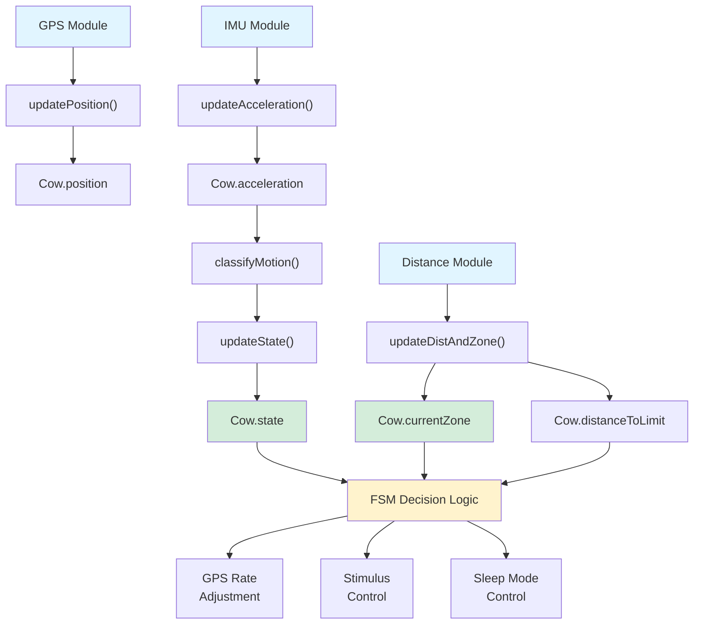

# TPP-IntelliFence - Cow Class

## 🎯 Propósito

La clase `Cow` representa el modelo de datos completo del estado de una vaca en tiempo real. Encapsula toda la información necesaria para el sistema de cerco virtual: posición GPS, estado de movimiento, aceleración, zona actual y distancia al límite del cerco.

---

## 📊 Estructura de Datos

### DeviceUID
Identificador único del dispositivo asignado a la vaca:
```cpp
struct DeviceUID {
    uint32_t w0;  // Word 0 del UID
    uint32_t w1;  // Word 1 del UID
    uint32_t w2;  // Word 2 del UID
};
```

**Uso**: Identificación única de cada collar en el sistema. Puede obtenerse del STM32 UID register.

---

### Position
Coordenadas GPS absolutas:
```cpp
struct Position {
    double latitude;   // Latitud en grados decimales (-90 a +90)
    double longitude;  // Longitud en grados decimales (-180 a +180)
};
```

**Ejemplo**:
```cpp
Position pos = {-34.921234, -57.954321};  // Buenos Aires, Argentina
```

---

### Acceleration
Datos del acelerómetro (LSM6DSO):
```cpp
struct Acceleration {
    double ax;  // Aceleración eje X (en g)
    double ay;  // Aceleración eje Y (en g)
    double az;  // Aceleración eje Z (en g)
};
```

**Uso**: Clasificación de comportamiento (dormida, pastando, en movimiento).

---

### CowState
Estado de comportamiento de la vaca:
```cpp
enum class CowState {
    SLEEP,      // Vaca dormida (aceleración muy baja)
    GRAZING,    // Vaca pastando (cabeza hacia abajo, movimiento z)
    MOVEMENT    // Vaca en movimiento activo
};
```

**Clasificación** (ver [FSM Architecture](02_fsm_architecture.md)):
```cpp
if (|ax| < 0.05 && |ay| < 0.05 && |az| < 0.05)
    → SLEEP
else if (|ax| < 0.05 && |ay| < 0.05 && |az| > 0.1)
    → GRAZING
else
    → MOVEMENT
```

---

### zone_t
Zona actual respecto al cerco virtual (definido en `zone.h`):
```cpp
typedef enum {
    GREEN_ZONE       = 0x00,  // Dentro del cerco (sin estímulo)
    LIGHT_BLUE_ZONE  = 0x01,  // Buzzer leve
    BLUE_ZONE        = 0x02,  // Buzzer medio
    DARK_BLUE_ZONE   = 0x03,  // Buzzer intenso
    YELLOW_ZONE      = 0x04,  // Buzzer + vibración
    RED_ZONE         = 0x05,  // Vibración intensa
    BLACK_ZONE       = 0x06   // Escapó (alerta crítica)
} zone_t;
```

---

## 🏗️ Clase Cow

### Definición Completa

```cpp
class Cow {
public:
    // Constructor
    Cow(DeviceUID id);

    // Métodos de actualización (setters)
    void updatePosition(Position pos);
    void updateAcceleration(Acceleration accel);
    void updateState(CowState state);
    void updateCurrentZone(zone_t zone);
    void updateDistanceToLimit(double distance);

    // Métodos de consulta (getters)
    DeviceUID getId() const;
    Position getPosition() const;
    Acceleration getAcceleration() const;
    CowState getState() const;
    zone_t getCurrentZone() const;
    double getDistanceToLimit() const;

private:
    DeviceUID id;                // Identificador único del dispositivo
    Position position;           // Coordenadas GPS actuales
    Acceleration acceleration;   // Aceleración 3-axis
    CowState state;             // Estado de comportamiento
    zone_t currentZone;         // Zona respecto al cerco
    double distanceToLimit;     // Distancia al límite más cercano (m)
};
```

---

## 🔧 API de la Clase

### Constructor

```cpp
Cow::Cow(DeviceUID id)
```

**Parámetros**:
- `id`: Identificador único del dispositivo (obtenido del STM32 UID)

**Inicialización**:
- `id` = parámetro recibido
- `position` = {0.0, 0.0}
- `acceleration` = {0.0, 0.0, 0.0}
- `state` = CowState::SLEEP
- `currentZone` = GREEN_ZONE
- `distanceToLimit` = 0.0

**Ejemplo**:
```cpp
DeviceUID deviceUID = {0x12345678, 0x9ABCDEF0, 0x11223344};
Cow cow(deviceUID);
```

---

### Métodos de Actualización

#### updatePosition()
```cpp
void Cow::updatePosition(Position pos)
```

Actualiza las coordenadas GPS de la vaca.

**Uso típico** (en FSM):
```cpp
// Recibir mensaje GPS
double latitude, longitude;
memcpy(&latitude, msgReceived->payload, sizeof(double));
memcpy(&longitude, msgReceived->payload + sizeof(double), sizeof(double));

cow.updatePosition({latitude, longitude});
```

---

#### updateAcceleration()
```cpp
void Cow::updateAcceleration(Acceleration accel)
```

Actualiza los datos del acelerómetro.

**Uso típico**:
```cpp
// Recibir mensaje IMU
double ax, ay, az;
memcpy(&ax, msgReceived->payload, sizeof(double));
memcpy(&ay, msgReceived->payload + sizeof(double), sizeof(double));
memcpy(&az, msgReceived->payload + 2 * sizeof(double), sizeof(double));

cow.updateAcceleration({ax, ay, az});
```

---

#### updateState()
```cpp
void Cow::updateState(CowState state)
```

Actualiza el estado de comportamiento de la vaca.

**Uso típico**:
```cpp
// Clasificar movimiento basado en aceleración
CowState newState = classifyMotion(cow.getAcceleration());
cow.updateState(newState);

// Adaptar GPS rate según estado
switch (cow.getState()) {
    case CowState::SLEEP:
        updateGpsAdqTime(GpsRate::STOP);
        break;
    case CowState::GRAZING:
        updateGpsAdqTime(GpsRate::SLOW);
        break;
    case CowState::MOVEMENT:
        updateGpsAdqTime(GpsRate::MEDIUM);
        break;
}
```

---

#### updateCurrentZone()
```cpp
void Cow::updateCurrentZone(zone_t zone)
```

Actualiza la zona actual respecto al cerco virtual.

**Uso típico**:
```cpp
// Recibir cálculo de zona desde módulo DISTANCE
zone_t zone;
float dist;
memcpy(&zone, msgReceived->payload, sizeof(zone_t));
memcpy(&dist, msgReceived->payload + sizeof(zone_t), sizeof(float));

cow.updateCurrentZone(zone);
cow.updateDistanceToLimit(dist);

// Enviar zona al módulo de estímulos
sendZoneToStimulus(cow.getCurrentZone(), MODULE_STIMULUS);
```

---

#### updateDistanceToLimit()
```cpp
void Cow::updateDistanceToLimit(double distance)
```

Actualiza la distancia (en metros) al límite más cercano del cerco.

**Uso típico**:
```cpp
// Determinar si está cerca del límite
if (cow.getDistanceToLimit() <= NEAR_LIMIT) {
    updateGpsAdqTime(GpsRate::FAST);  // GPS cada 10s
} else {
    updateGpsAdqTime(GpsRate::MEDIUM); // GPS cada 30s
}
```

---

### Métodos de Consulta

#### getId()
```cpp
DeviceUID Cow::getId() const
```

Retorna el identificador único del dispositivo.

**Ejemplo**:
```cpp
DeviceUID uid = cow.getId();
printf("Device UID: %08X-%08X-%08X\r\n", uid.w0, uid.w1, uid.w2);
```

---

#### getPosition()
```cpp
Position Cow::getPosition() const
```

Retorna la posición GPS actual.

**Ejemplo**:
```cpp
Position pos = cow.getPosition();
printf("GPS: lat=%.6f, lon=%.6f\r\n", pos.latitude, pos.longitude);

// Enviar posición por LoRa
sendPosition(MSG_ID_LORA_SEND_POSITION, MODULE_LORA_TX, cow);
```

---

#### getAcceleration()
```cpp
Acceleration Cow::getAcceleration() const
```

Retorna los datos de aceleración actuales.

**Ejemplo**:
```cpp
Acceleration accel = cow.getAcceleration();
printf("IMU: ax=%.2f, ay=%.2f, az=%.2f g\r\n", accel.ax, accel.ay, accel.az);

// Clasificar estado
CowState state = classifyMotion(accel);
```

---

#### getState()
```cpp
CowState Cow::getState() const
```

Retorna el estado de comportamiento actual.

**Ejemplo**:
```cpp
switch (cow.getState()) {
    case CowState::SLEEP:
        printf("Cow is sleeping\r\n");
        break;
    case CowState::GRAZING:
        printf("Cow is grazing\r\n");
        break;
    case CowState::MOVEMENT:
        printf("Cow is moving\r\n");
        break;
}
```

---

#### getCurrentZone()
```cpp
zone_t Cow::getCurrentZone() const
```

Retorna la zona actual respecto al cerco.

**Ejemplo**:
```cpp
zone_t zone = cow.getCurrentZone();
if (zone == GREEN_ZONE) {
    printf("Cow is safely inside the fence\r\n");
} else if (zone == BLACK_ZONE) {
    printf("ALERT: Cow escaped!\r\n");
}
```

---

#### getDistanceToLimit()
```cpp
double Cow::getDistanceToLimit() const
```

Retorna la distancia al límite más cercano en metros.

**Ejemplo**:
```cpp
double dist = cow.getDistanceToLimit();
printf("Distance to fence: %.2f meters\r\n", dist);

if (dist < 5.0) {
    printf("WARNING: Very close to fence!\r\n");
}
```

---

## 💾 Tamaño de Memoria

```cpp
sizeof(DeviceUID)      = 12 bytes  (3 × uint32_t)
sizeof(Position)       = 16 bytes  (2 × double)
sizeof(Acceleration)   = 24 bytes  (3 × double)
sizeof(CowState)       =  4 bytes  (enum class)
sizeof(zone_t)         =  4 bytes  (enum)
sizeof(double)         =  8 bytes

Total Cow class ≈ 72 bytes
```

**Optimización**: Perfecto para stack allocation en FreeRTOS task.

---

## 🧪 Ejemplo de Uso Completo

```cpp
// En fsmTask()
void fsmTask(void *argument) {
    // Obtener UID del STM32
    DeviceUID deviceUID;
    deviceUID.w0 = *(uint32_t*)(UID_BASE);
    deviceUID.w1 = *(uint32_t*)(UID_BASE + 4);
    deviceUID.w2 = *(uint32_t*)(UID_BASE + 8);
    
    // Crear objeto Cow
    Cow cow(deviceUID);
    
    while(1) {
        // Actualizar GPS
        if (dequeuedMessage(&msg, fence) == HAL_OK) {
            if (msg->id == MSG_ID_SEND_GPS) {
                updatePosition(cow, msg);
            }
        }
        
        // Actualizar IMU
        if (msg->id == MSG_ID_SEND_IMU) {
            updateAcceleration(msg, cow);
            updateState(cow);
        }
        
        // Actualizar zona
        if (msg->id == MSG_ID_SEND_ZONE_AND_DISTANCE_TO_FENCE) {
            updateDistAndZone(msg, cow);
        }
        
        // Tomar decisiones según estado
        switch (cow.getState()) {
            case CowState::SLEEP:
                enterLowPowerSleep();
                break;
            case CowState::MOVEMENT:
                if (cow.getDistanceToLimit() < NEAR_LIMIT) {
                    updateGpsAdqTime(GpsRate::FAST);
                }
                break;
        }
        
        osDelay(100);
    }
}
```

---

## 📊 Diagrama de Flujo de Datos



---

## ✅ Testing

Ver [Cow & Fence Tests](../../03_testing/01_cow_fence_tests.md) para suite completa de tests.

**Tests incluidos**:
- ✅ Creación e inicialización
- ✅ Actualización de posición GPS
- ✅ Actualización de aceleración
- ✅ Transiciones de estado
- ✅ Actualización de zona
- ✅ Getters y validación de datos

---

## 📖 Documentación Relacionada

- [System Overview](01_system_overview.md) - Arquitectura general
- [FSM Architecture](02_fsm_architecture.md) - Uso de Cow en la FSM
- [Fence Class](05_fence_class.md) - Clase complementaria para cerco
- [Cow & Fence Tests](../../03_testing/01_cow_fence_tests.md) - Suite de tests

---

**Última actualización**: 22 de Noviembre de 2025  
**Versión**: v1.0
