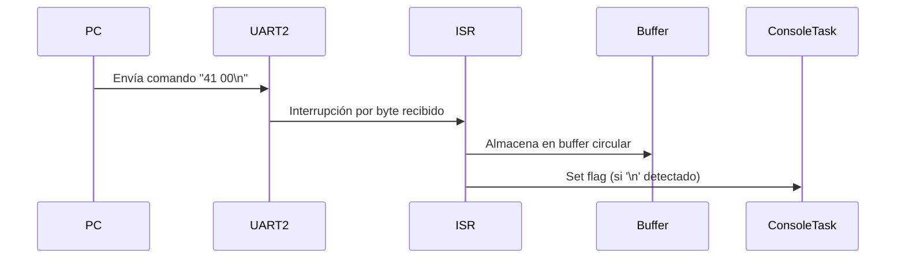
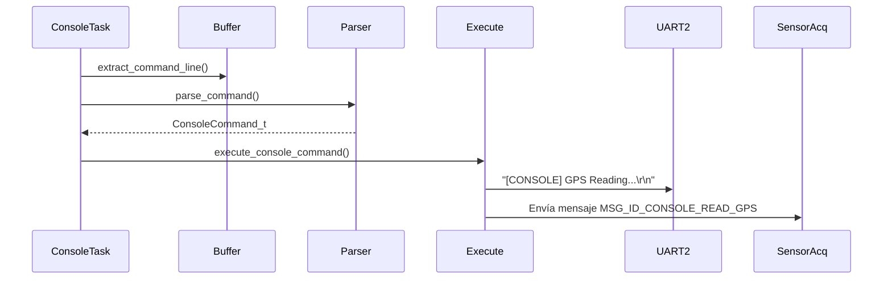
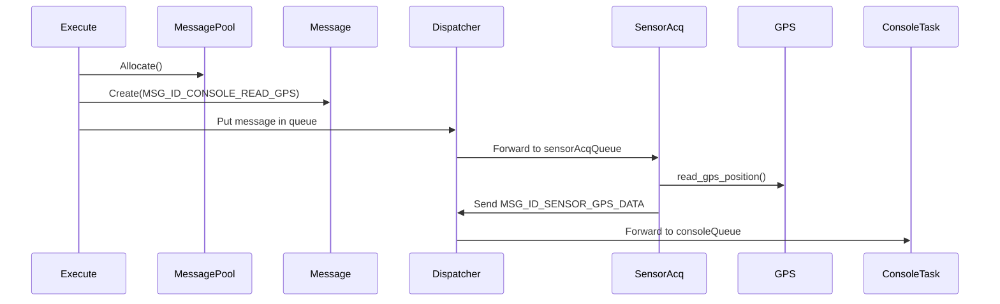
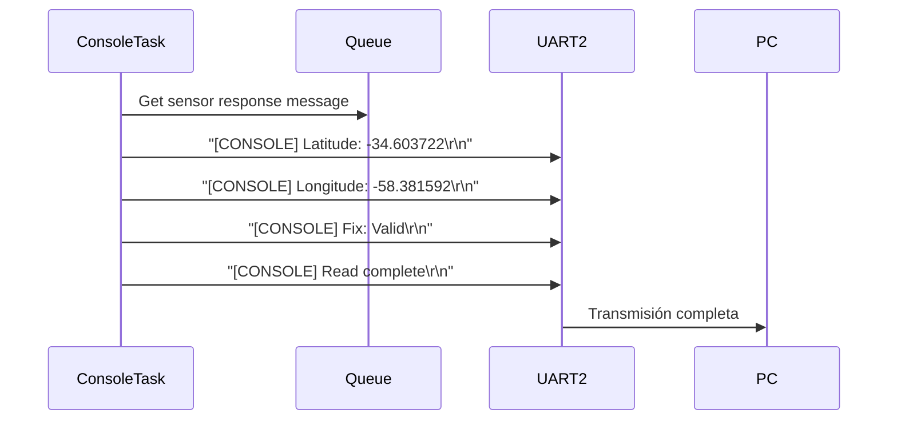

# Implementación del Protocolo de Consola UART2

**Fecha:** Febrero 2026  
**Sistema:** Debug App Intelligence - Cattle GPS Monitoring  
**Archivo:** Console Protocol Implementation

---

## 📋 Descripción General

El sistema de consola permite la comunicación bidireccional entre la aplicación web (backend) y el microcontrolador STM32WL55 a través de UART2. La implementación sigue el protocolo especificado en `STM32_CONSOLE_PROTOCOL.md`.

---

## 🔧 Archivos Modificados

| Archivo | Descripción | Cambios Principales |
|---------|-------------|---------------------|
| [`CM4/Core/Src/threads/console.cpp`](../../CM4/Core/Src/threads/console.cpp) | Tarea principal de consola | Actualización de formato de respuestas con prefijo `[CONSOLE]` |
| [`CM4/Core/Inc/threads/console.h`](../../CM4/Core/Inc/threads/console.h) | Header del módulo de consola | Documentación del protocolo |

---

## 📡 Protocolo Implementado

### Formato de Comandos (PC → MCU)

```
<MODULE_CODE> <OPERATION_CODE> [DATA]\n
```

**Ejemplo:**
```
41 00\n           → Leer GPS
42 00\n           → Leer IMU
43 00\n           → Leer INA_GPS (corriente)
41 01 A1 B2\n     → Configurar GPS con datos A1 B2
```

### Códigos de Módulos

| Código | Módulo | Descripción |
|--------|--------|-------------|
| `41` | GPS | Módulo GPS SAM-M10Q |
| `42` | IMU | Acelerómetro LSM6DSO |
| `43` | INA_GPS | Sensor de corriente INA226 (GPS) |
| `44` | INA_IMU | Sensor de corriente INA226 (IMU) |
| `45` | INA_MCU | Sensor de corriente INA226 (MCU) |

### Códigos de Operación

| Código | Operación | Descripción |
|--------|-----------|-------------|
| `00` | READ | Leer datos del módulo |
| `01` | WRITE | Escribir/configurar el módulo |

---

## 📤 Formato de Respuestas (MCU → PC)

**IMPORTANTE:** Todas las respuestas que deben aparecer en la consola web llevan el prefijo `[CONSOLE]`. El backend elimina este prefijo antes de mostrar el mensaje al usuario.

### Ejemplo: Lectura de GPS (41 00)

**Comando recibido:**
```
41 00\n
```

**Respuestas enviadas:**
```
[CONSOLE] GPS Reading...
[CONSOLE] Latitude: -34.603722
[CONSOLE] Longitude: -58.381592
[CONSOLE] Fix: Valid
[CONSOLE] Read complete
```

### Ejemplo: Lectura de IMU (42 00)

**Comando recibido:**
```
42 00\n
```

**Respuestas enviadas:**
```
[CONSOLE] IMU Reading...
[CONSOLE] Accel X: 0.123 g
[CONSOLE] Accel Y: -0.045 g
[CONSOLE] Accel Z: 1.005 g
[CONSOLE] Read complete
```

### Ejemplo: Lectura de INA (43 00, 44 00, 45 00)

**Comando recibido:**
```
43 00\n  (INA_GPS)
```

**Respuestas enviadas:**
```
[CONSOLE] INA_GPS Reading...
[CONSOLE] Current: 45.5 mA
[CONSOLE] Read complete
```

### Ejemplo: Configuración/Escritura (41 01)

**Comando recibido:**
```
41 01 A1 B2\n
```

**Respuestas enviadas:**
```
[CONSOLE] GPS Write command received
[CONSOLE] GPS Config OK
[CONSOLE] ACK
```

### Mensajes de Error

**Comando inválido:**
```
[CONSOLE] ERROR: Invalid command format
[CONSOLE] Expected format: <MODULE_CODE> <OP_CODE> [DATA]
[CONSOLE] Example: 41 00 (Read GPS)
```

**Código de módulo inválido:**
```
[CONSOLE] ERROR: Invalid module code 99
[CONSOLE] Valid codes: 41-45
```

**Operación desconocida:**
```
[CONSOLE] ERROR: Unknown operation code
```

**Error de comunicación:**
```
[CONSOLE] ERROR: GPS read request failed
[CONSOLE] ERROR: Memory allocation failed
```

---

## 🔄 Flujo de Funcionamiento

### 1. Recepción de Comandos



**Implementación:**
- La interrupción `HAL_UART_RxCpltCallback()` en [`usart_if.c`](../../CM4/Core/Src/usart_if.c) maneja la recepción byte a byte
- Los datos se almacenan en un buffer circular `console_uart_rx_buffer[]`
- Al detectar `\n`, se activa el flag `console_command_ready_flag`

### 2. Procesamiento en Console Task



**Código relevante:**
```cpp
void consoleTask(void *argument) {
    while (1) {
        // Verificar comandos UART
        if (console_command_ready_flag) {
            console_command_ready_flag = 0;
            extract_command_line(command_line, COMMAND_LINE_SIZE);
            
            ConsoleCommand_t cmd = parse_command(command_line);
            execute_console_command(&cmd);
        }
        
        // Verificar mensajes de respuesta de sensores
        if (osMessageQueueGet(consoleQueueHandle, &msgReceived, NULL, 10) == osOK) {
            // Procesar respuestas...
        }
    }
}
```

### 3. Solicitud a Sensor Acquisition Task



**Códigos de mensaje utilizados:**

| Request (Console → SensorAcq) | Response (SensorAcq → Console) |
|-------------------------------|--------------------------------|
| `MSG_ID_CONSOLE_READ_GPS`     | `MSG_ID_SENSOR_GPS_DATA`      |
| `MSG_ID_CONSOLE_READ_IMU`     | `MSG_ID_SENSOR_IMU_DATA`      |
| `MSG_ID_CONSOLE_READ_INA_GPS` | `MSG_ID_SENSOR_INA_GPS_DATA`  |
| `MSG_ID_CONSOLE_READ_INA_IMU` | `MSG_ID_SENSOR_INA_IMU_DATA`  |
| `MSG_ID_CONSOLE_READ_INA_MCU` | `MSG_ID_SENSOR_INA_MCU_DATA`  |

### 4. Respuesta al Usuario



**Implementación:**
```cpp
case MSG_ID_SENSOR_GPS_DATA:
    if (msgReceived->length == sizeof(gpsData_t)) {
        gpsData_t gpsData;
        memcpy(&gpsData, msgReceived->payload, sizeof(gpsData_t));
        
        char response[256];
        snprintf(response, sizeof(response), 
                "[CONSOLE] Latitude: %.6f\r\n", gpsData.latitude);
        send_uart_response(response);
        snprintf(response, sizeof(response), 
                "[CONSOLE] Longitude: %.6f\r\n", gpsData.longitude);
        send_uart_response(response);
        snprintf(response, sizeof(response), 
                "[CONSOLE] Fix: %s\r\n", gpsData.fix ? "Valid" : "No Fix");
        send_uart_response(response);
        send_uart_response("[CONSOLE] Read complete\r\n");
    }
    break;
```

---

## 🧪 Testing

### Pruebas Manuales desde Terminal Serial

**Herramientas:**
- PuTTY, Tera Term, o cualquier terminal serial
- Baudrate: 115200
- Data bits: 8
- Parity: None
- Stop bits: 1

**Comandos de prueba:**

```bash
# Leer GPS
41 00

# Leer IMU
42 00

# Leer corriente GPS
43 00

# Leer corriente IMU
44 00

# Leer corriente MCU
45 00

# Configurar GPS (ejemplo)
41 01 A1 B2

# Comando inválido (para probar manejo de errores)
99 00
```

### Pruebas desde la Aplicación Web

La aplicación web (Debug App Intelligence) proporciona una interfaz gráfica para enviar comandos y visualizar respuestas.

**Características:**
- Selección de dispositivo (GPS, IMU, INA_GPS, INA_IMU, INA_MCU)
- Selección de operación (READ/WRITE)
- Campo para datos opcionales (WRITE)
- Visualización de respuestas en tiempo real
- Timeout de 2 segundos

---

## 📊 Uso de Memoria

**Compilación exitosa:**
```
Memory region         Used Size  Region Size  %age Used
        RAM1:       29656 B        32 KB     90.50%
  RAM_SHARED:         768 B         4 KB     18.75%
       FLASH:      100280 B       124 KB     78.98%
```

**Buffers utilizados:**
- `console_uart_rx_buffer`: 128 bytes (buffer circular para recepción UART)
- `command_line`: 128 bytes (línea de comando extraída)
- Stack de mensajes: Gestionado por `MessagePool`

---

## ⚠️ Consideraciones Importantes

### 1. Prefijo [CONSOLE] es OBLIGATORIO

Todos los mensajes que deben ser visibles en la interfaz web **DEBEN** llevar el prefijo `[CONSOLE]`.

**✅ CORRECTO:**
```cpp
send_uart_response("[CONSOLE] GPS Reading...\r\n");
```

**❌ INCORRECTO:**
```cpp
send_uart_response("GPS Reading...\r\n");  // No aparecerá en consola web
```

### 2. Mensajes sin Prefijo [CONSOLE]

Los mensajes que **NO** llevan el prefijo `[CONSOLE]` son para uso interno o debug:

```cpp
RTOS_LOG_DEBUG("[SENSOR_ACQ] GPS read: lat %.6f, lon %.6f\r\n", ...);
RTOS_LOG_INFO("[FSM] State transition...\r\n");
```

Estos mensajes se procesan internamente pero no aparecen en la consola web.

### 3. Thread Safety

- La función `send_uart_response()` usa `HAL_UART_Transmit()` que es **blocking** con timeout de 1000ms
- No se requiere mutex porque FreeRTOS garantiza que solo una tarea ejecuta a la vez
- El buffer circular de recepción se maneja en ISR, con variables `volatile`

### 4. Timeout del Backend

El backend espera respuesta por hasta **2 segundos**. Si no recibe respuesta:
```
No response received (timeout after 2s)
```

**Recomendación:** Siempre enviar al menos un mensaje de confirmación inmediatamente:
```cpp
send_uart_response("[CONSOLE] GPS Reading...\r\n");
```

---

## 🔍 Debugging

### Logs Útiles

Para debug interno (no visible en consola web):

```cpp
RTOS_LOG_DEBUG("[CONSOLE] Command received: %s\r\n", command_line);
RTOS_LOG_DEBUG("[CONSOLE] Executing command: module=%d, operation=0x%02X\r\n", 
              cmd->module_code, cmd->operation_code);
RTOS_LOG_DEBUG("[CONSOLE] GPS read request sent\r\n");
```

### Problemas Comunes

| Problema | Causa Probable | Solución |
|----------|---------------|----------|
| Comando no responde | Timeout de UART | Verificar baudrate (115200) |
| Respuesta no aparece en web | Falta prefijo `[CONSOLE]` | Agregar prefijo a todos los mensajes |
| Buffer overflow | Comando muy largo | Limitar a 128 caracteres |
| Parse error | Formato incorrecto | Usar formato `XX YY [DATA]\n` |

---

## 📝 Ejemplo Completo

### Secuencia de Lectura de GPS

**1. Usuario envía desde web:**
```
Dispositivo: GPS (41)
Operación: READ (00)
```

**2. Backend envía por UART:**
```
41 00\n
```

**3. MCU responde:**
```
[CONSOLE] GPS Reading...
[CONSOLE] Latitude: -34.603722
[CONSOLE] Longitude: -58.381592
[CONSOLE] Fix: Valid
[CONSOLE] Read complete
```

**4. Backend procesa:**
- Elimina prefijos `[CONSOLE]`
- Parsea valores con regex
- Muestra en interfaz web:

```
GPS Reading...
Latitude: -34.603722
Longitude: -58.381592
Fix: Valid
Read complete
```

---

## 🔗 Referencias

- **Especificación del Protocolo:** [`STM32_CONSOLE_PROTOCOL.md`](STM32_CONSOLE_PROTOCOL.md)
- **Implementación Console Task:** [`console.cpp`](../../CM4/Core/Src/threads/console.cpp)
- **Sensor Acquisition Task:** [`sensorAcqTask.cpp`](../../CM4/Core/Src/threads/sensorAcqTask.cpp)
- **Message IDs:** [`messages_id.h`](../../CM4/Core/Inc/Modules/Messages/messages_id.h)

---

## ✅ Verificación de Implementación

- [x] Parser de comandos implementado
- [x] Validación de códigos de módulo (41-45)
- [x] Validación de códigos de operación (00-01)
- [x] Prefijo `[CONSOLE]` en todas las respuestas
- [x] Mensajes informativos detallados (Reading..., valores, complete)
- [x] Manejo de errores con mensajes apropiados
- [x] Integración con Sensor Acquisition Task
- [x] Sistema de mensajería RTOS
- [x] Compilación exitosa
- [x] Documentación completa

---

**Última actualización:** Febrero 2026  
**Estado:** ✅ Implementado y funcional
