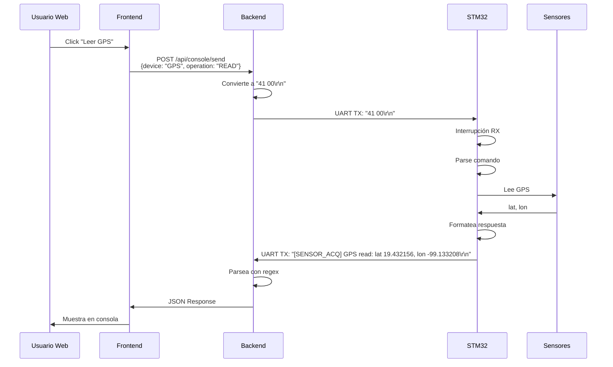

# Protocolo de Consola UART para STM32

## CONTEXTO DEL SISTEMA

Sistema de monitoreo de ganado con comunicación UART entre una aplicación web (vía backend FastAPI) y un microcontrolador STM32 que gestiona sensores GPS, IMU y medidores de corriente INA219.

## ARQUITECTURA GENERAL

```
[Aplicación Web] ←→ [Backend FastAPI] ←→ [UART] ←→ [STM32] ←→ [Sensores GPS/IMU/INA]
```

El STM32 debe recibir comandos por UART, procesarlos, interactuar con los sensores correspondientes y enviar respuestas formateadas de vuelta.

---

## ESPECIFICACIÓN DEL PROTOCOLO UART

### 1. CONFIGURACIÓN DE COMUNICACIÓN

- **Baudrate:** Configurable (típicamente 115200)
- **Formato:** 8 bits de datos, sin paridad, 1 bit de stop (8N1)
- **Encoding:** UTF-8
- **Line Ending:** `\n` (newline)
- **Buffer:** El STM32 debe implementar un buffer circular de recepción

### 2. FORMATO DE COMANDOS (RECEPCIÓN)

Los comandos llegan en formato de texto ASCII con la siguiente estructura:

```
<MODULE_CODE> <OPERATION_CODE> [DATA]\n
```

**Componentes:**
- `MODULE_CODE`: Código del módulo (2 dígitos decimales)
- `OPERATION_CODE`: Código de operación (2 dígitos hexadecimales)
- `DATA`: Datos opcionales en hexadecimal (solo para operaciones de escritura)
- Cada componente está separado por un espacio
- Termina con `\n`

**Códigos de Módulos:**

| Código | Módulo | Hardware |
|--------|--------|----------|
| `41` | GPS | Módulo GPS (UART2 típicamente) |
| `42` | IMU | Acelerómetro I2C (LIS2DH12, LIS3DH, etc.) |
| `43` | INA_GPS | Sensor de corriente GPS I2C (INA219) |
| `44` | INA_IMU | Sensor de corriente IMU I2C (INA219) |
| `45` | INA_MCU | Sensor de corriente MCU I2C (INA219) |

**Códigos de Operación:**

| Código | Operación | Descripción |
|--------|-----------|-------------|
| `00` | READ | Leer datos del módulo |
| `01` | WRITE | Escribir/configurar el módulo |

**Ejemplos de Comandos:**

```
41 00\n           → Leer GPS
42 00\n           → Leer IMU
43 00\n           → Leer corriente del GPS (INA219)
44 00\n           → Leer corriente del IMU (INA219)
45 00\n           → Leer corriente del MCU (INA219)
41 01 A1 B2\n     → Escribir configuración al GPS (datos: 0xA1, 0xB2)
42 01 FF\n        → Escribir configuración al IMU (dato: 0xFF)
```

---

### 3. FORMATO DE RESPUESTAS (TRANSMISIÓN)

El STM32 debe responder con mensajes de texto legibles que el backend pueda parsear mediante expresiones regulares.

**Formato General:**
```
[TAG] Module: response_text\n
```

**Formatos Específicos por Sensor:**

#### GPS (Módulo 41):

```c
// Respuesta de lectura GPS READ (41 00)
"[SENSOR_ACQ] GPS read: lat 19.432156, lon -99.133208\r\n"

// Formato: lat y lon son float con 6 decimales
// lat 0.0, lon 0.0 indica que no hay fix GPS válido
```

#### IMU/Acelerómetro (Módulo 42):

```c
// Respuesta de lectura IMU READ (42 00)
"[SENSOR_ACQ] IMU read: (0.125 g, -0.050 g, 0.980 g)\r\n"

// Formato: (X g, Y g, Z g) con valores en g (gravedad)
// Los valores son float divididos por 1000 (mili-g a g)
```

#### Sensores INA219 (Módulos 43, 44, 45):

```c
// Respuesta de lectura INA_GPS READ (43 00)
"[SENSOR_ACQ] INA GPS current read: 45.5 mA\r\n"

// Respuesta de lectura INA_IMU READ (44 00)
"[SENSOR_ACQ] INA IMU current read: 12.3 mA\r\n"

// Respuesta de lectura INA_MCU READ (45 00)
"[SENSOR_ACQ] INA MCU current read: 78.9 mA\r\n"

// Formato: Corriente en mA como float
```

#### Respuestas de Error:

```c
"[ERROR] Invalid command format\r\n"
"[ERROR] Unknown module code: XX\r\n"
"[ERROR] GPS read failed\r\n"
"[ERROR] IMU initialization failed\r\n"
"[ERROR] INA sensor not responding\r\n"
```

#### Respuestas de Escritura:

```c
"[CONSOLE] GPS config updated OK\r\n"
"[CONSOLE] IMU config updated OK\r\n"
"[ERROR] Write operation failed\r\n"
```

---

## IMPLEMENTACIÓN EN STM32

### 4. COMPONENTES DEL CÓDIGO

#### A) Buffer de Recepción UART

```c
// Buffer circular para recibir comandos
#define UART_RX_BUFFER_SIZE 256
uint8_t uart_rx_buffer[UART_RX_BUFFER_SIZE];
volatile uint16_t uart_rx_head = 0;
volatile uint16_t uart_rx_tail = 0;

// Línea de comando completa
char command_line[128];
volatile uint8_t command_ready_flag = 0;
```

#### B) Interrupción UART RX

```c
void HAL_UART_RxCpltCallback(UART_HandleTypeDef *huart)
{
    if(huart->Instance == UART_CONSOLE_INSTANCE) // UART1 o la configurada
    {
        uint8_t received_byte;
        
        // Leer byte recibido
        HAL_UART_Receive_IT(huart, &received_byte, 1);
        
        // Agregar al buffer circular
        uart_rx_buffer[uart_rx_head] = received_byte;
        uart_rx_head = (uart_rx_head + 1) % UART_RX_BUFFER_SIZE;
        
        // Detectar fin de línea
        if(received_byte == '\n') {
            command_ready_flag = 1;
        }
    }
}
```

#### C) Parser de Comandos

```c
typedef struct {
    uint8_t module_code;      // 41-45
    uint8_t operation_code;   // 0x00 o 0x01
    uint8_t data[16];         // Datos para WRITE
    uint8_t data_length;      // Longitud de datos
    bool valid;               // Comando válido
} ConsoleCommand_t;

ConsoleCommand_t parse_command(char* cmd_line)
{
    ConsoleCommand_t cmd = {0};
    
    // Ejemplo: "41 00\r\n" o "41 01 A1 B2\r\n"
    int module, operation;
    char data_str[64] = {0};
    
    // Parsear componentes
    int parsed = sscanf(cmd_line, "%d %x %s", &module, &operation, data_str);
    
    if(parsed >= 2) {
        cmd.module_code = (uint8_t)module;
        cmd.operation_code = (uint8_t)operation;
        cmd.valid = true;
        
        // Parsear datos hex si existen
        if(parsed == 3) {
            // Convertir string hex a bytes
            cmd.data_length = hex_string_to_bytes(data_str, cmd.data, 16);
        }
    }
    
    return cmd;
}

// Función auxiliar para convertir string hex a bytes
uint8_t hex_string_to_bytes(char* hex_str, uint8_t* bytes, uint8_t max_len)
{
    uint8_t len = 0;
    char* token = strtok(hex_str, " ");
    
    while(token != NULL && len < max_len) {
        bytes[len++] = (uint8_t)strtol(token, NULL, 16);
        token = strtok(NULL, " ");
    }
    
    return len;
}
```

#### D) Ejecutor de Comandos

```c
void execute_console_command(ConsoleCommand_t* cmd)
{
    char response[256];
    
    if(!cmd->valid) {
        send_uart_response("[ERROR] Invalid command format\r\n");
        return;
    }
    
    switch(cmd->module_code)
    {
        case 41: // GPS
            if(cmd->operation_code == 0x00) {
                // READ GPS
                float lat, lon;
                if(gps_read_coordinates(&lat, &lon) == HAL_OK) {
                    snprintf(response, sizeof(response),
                             "[SENSOR_ACQ] GPS read: lat %.6f, lon %.6f\r\n",
                             lat, lon);
                } else {
                    snprintf(response, sizeof(response),
                             "[ERROR] GPS read failed\r\n");
                }
            }
            else if(cmd->operation_code == 0x01) {
                // WRITE GPS (configuración)
                if(gps_write_config(cmd->data, cmd->data_length) == HAL_OK) {
                    snprintf(response, sizeof(response),
                             "[CONSOLE] GPS config updated OK\r\n");
                } else {
                    snprintf(response, sizeof(response),
                             "[ERROR] GPS write failed\r\n");
                }
            }
            break;
            
        case 42: // IMU
            if(cmd->operation_code == 0x00) {
                // READ IMU
                float ax, ay, az;
                if(imu_read_acceleration(&ax, &ay, &az) == HAL_OK) {
                    snprintf(response, sizeof(response),
                             "[SENSOR_ACQ] IMU read: (%.3f g, %.3f g, %.3f g)\r\n",
                             ax, ay, az);
                } else {
                    snprintf(response, sizeof(response),
                             "[ERROR] IMU read failed\r\n");
                }
            }
            else if(cmd->operation_code == 0x01) {
                // WRITE IMU (configuración)
                if(imu_write_config(cmd->data, cmd->data_length) == HAL_OK) {
                    snprintf(response, sizeof(response),
                             "[CONSOLE] IMU config updated OK\r\n");
                } else {
                    snprintf(response, sizeof(response),
                             "[ERROR] IMU write failed\r\n");
                }
            }
            break;
            
        case 43: // INA_GPS
            if(cmd->operation_code == 0x00) {
                float current_ma;
                if(ina219_read_current(INA_GPS_ADDR, &current_ma) == HAL_OK) {
                    snprintf(response, sizeof(response),
                             "[SENSOR_ACQ] INA GPS current read: %.1f mA\r\n",
                             current_ma);
                } else {
                    snprintf(response, sizeof(response),
                             "[ERROR] INA GPS read failed\r\n");
                }
            }
            break;
            
        case 44: // INA_IMU
            if(cmd->operation_code == 0x00) {
                float current_ma;
                if(ina219_read_current(INA_IMU_ADDR, &current_ma) == HAL_OK) {
                    snprintf(response, sizeof(response),
                             "[SENSOR_ACQ] INA IMU current read: %.1f mA\r\n",
                             current_ma);
                } else {
                    snprintf(response, sizeof(response),
                             "[ERROR] INA IMU read failed\r\n");
                }
            }
            break;
            
        case 45: // INA_MCU
            if(cmd->operation_code == 0x00) {
                float current_ma;
                if(ina219_read_current(INA_MCU_ADDR, &current_ma) == HAL_OK) {
                    snprintf(response, sizeof(response),
                             "[SENSOR_ACQ] INA MCU current read: %.1f mA\r\n",
                             current_ma);
                } else {
                    snprintf(response, sizeof(response),
                             "[ERROR] INA MCU read failed\r\n");
                }
            }
            break;
            
        default:
            snprintf(response, sizeof(response),
                     "[ERROR] Unknown module code: %d\r\n",
                     cmd->module_code);
            break;
    }
    
    // Enviar respuesta por UART
    send_uart_response(response);
}
```

#### E) Funciones de Utilidad

```c
// Enviar respuesta por UART
void send_uart_response(const char* response)
{
    HAL_UART_Transmit(&huart_console, (uint8_t*)response, strlen(response), HAL_MAX_DELAY);
}

// Extraer línea de comando del buffer circular
void extract_command_line(char* dest, uint16_t max_len)
{
    uint16_t i = 0;
    
    while(uart_rx_tail != uart_rx_head && i < (max_len - 1))
    {
        dest[i] = uart_rx_buffer[uart_rx_tail];
        uart_rx_tail = (uart_rx_tail + 1) % UART_RX_BUFFER_SIZE;
        
        if(dest[i] == '\n') {
            i++;
            break;
        }
        i++;
    }
    
    dest[i] = '\0'; // Null terminator
}
```

#### F) Loop Principal

```c
void console_task(void)
{
    if(command_ready_flag)
    {
        command_ready_flag = 0;
        
        // Extraer línea del buffer
        extract_command_line(command_line, sizeof(command_line));
        
        // Parsear comando
        ConsoleCommand_t cmd = parse_command(command_line);
        
        // Ejecutar comando
        execute_console_command(&cmd);
    }
}

// En main loop:
int main(void)
{
    // ... Inicialización ...
    
    // Iniciar recepción UART con interrupciones
    HAL_UART_Receive_IT(&huart_console, &uart_rx_buffer[0], 1);
    
    while(1)
    {
        console_task();
        
        // ... Otras tareas ...
    }
}
```

---

## 5. EXPRESIONES REGULARES DE PARSING EN EL BACKEND

El backend usa estas regex para parsear las respuestas del STM32:

```python
# GPS
r'GPS read:\s*lat\s*([-+]?\d*\.?\d+),\s*lon\s*([-+]?\d*\.?\d+)'

# IMU
r'IMU read:\s*\(\s*([-+]?\d*\.?\d+)\s*g,\s*([-+]?\d*\.?\d+)\s*g,\s*([-+]?\d*\.?\d+)\s*g\s*\)'

# INA GPS
r'INA GPS current read:\s*([-+]?\d*\.?\d+)\s*mA'

# INA IMU
r'INA IMU current read:\s*([-+]?\d*\.?\d+)\s*mA'

# INA MCU
r'INA MCU current read:\s*([-+]?\d*\.?\d+)\s*mA'
```

**⚠️ CRÍTICO:** Las respuestas del STM32 deben cumplir **EXACTAMENTE** estos formatos para que el backend pueda parsearlas correctamente.

---

## 6. CONSIDERACIONES IMPORTANTES

### Timing y Respuestas

- El backend espera una respuesta en máximo **2 segundos** (timeout)
- El STM32 debe responder lo antes posible después de ejecutar el comando
- Si la operación toma tiempo (ej: GPS fix), enviar respuesta inmediata con los últimos datos conocidos

### Manejo de Errores

- **Siempre responder**, incluso si hay un error
- Usar prefijo `[ERROR]` para mensajes de error
- Incluir información descriptiva del error

### Buffer Management

- Implementar buffer circular para evitar pérdida de datos
- Limpiar buffer después de procesar cada comando
- Manejar comandos incompletos o malformados sin bloquear

### Conversiones Numéricas

- **GPS:** latitud/longitud con 6 decimales (float)
- **IMU:** aceleración en g con 3 decimales (convertir mili-g a g dividiendo por 1000)
- **INA:** corriente en mA con 1 decimal (float)

### Testing

- El backend incluye un script de prueba: `test_uart_console.py`
- Puedes probar comandos manualmente con:
  ```bash
  curl -X POST "http://localhost:8000/api/console/serial/raw?command=41%2000"
  ```

---

## 7. FLUJO DE COMUNICACIÓN COMPLETO



**Pasos detallados:**

1. Usuario en Web → "Leer GPS"
2. Frontend → `POST /api/console/send {device: "GPS", operation: "READ"}`
3. Backend → Convierte a `"41 00\r\n"`
4. Backend → Envía por UART
5. STM32 → Recibe en interrupción
6. STM32 → Parsea comando
7. STM32 → Lee GPS
8. STM32 → Formatea respuesta `"[SENSOR_ACQ] GPS read: lat 19.432156, lon -99.133208\r\n"`
9. STM32 → Envía por UART
10. Backend → Recibe y parsea con regex
11. Backend → Responde a frontend con JSON
12. Frontend → Muestra en consola web

---

## 8. EJEMPLO COMPLETO DE IMPLEMENTACIÓN

### Archivo: `console_protocol.h`

```c
#ifndef CONSOLE_PROTOCOL_H
#define CONSOLE_PROTOCOL_H

#include "stm32XXxx_hal.h" // Reemplazar con tu MCU
#include <stdbool.h>
#include <stdint.h>

// Module codes
#define MODULE_GPS      41
#define MODULE_IMU      42
#define MODULE_INA_GPS  43
#define MODULE_INA_IMU  44
#define MODULE_INA_MCU  45

// Operation codes
#define OP_READ   0x00
#define OP_WRITE  0x01

// Buffer sizes
#define UART_RX_BUFFER_SIZE 256
#define COMMAND_LINE_SIZE   128
#define RESPONSE_SIZE       256
#define MAX_DATA_LEN        16

// Command structure
typedef struct {
    uint8_t module_code;
    uint8_t operation_code;
    uint8_t data[MAX_DATA_LEN];
    uint8_t data_length;
    bool valid;
} ConsoleCommand_t;

// Function prototypes
void console_init(UART_HandleTypeDef* huart);
void console_task(void);
void console_uart_rx_callback(void);
ConsoleCommand_t parse_command(char* cmd_line);
void execute_console_command(ConsoleCommand_t* cmd);
void send_uart_response(const char* response);

#endif // CONSOLE_PROTOCOL_H
```

### Archivo: `console_protocol.c`

```c
#include "console_protocol.h"
#include <string.h>
#include <stdio.h>
#include <stdlib.h>

// External UART handle (set in init)
static UART_HandleTypeDef* huart_console = NULL;

// Buffer circular
static uint8_t uart_rx_buffer[UART_RX_BUFFER_SIZE];
static volatile uint16_t uart_rx_head = 0;
static volatile uint16_t uart_rx_tail = 0;

// Command line buffer
static char command_line[COMMAND_LINE_SIZE];
static volatile uint8_t command_ready_flag = 0;

// Current byte being received
static uint8_t current_rx_byte = 0;

/**
 * Initialize console protocol
 */
void console_init(UART_HandleTypeDef* huart)
{
    huart_console = huart;
    uart_rx_head = 0;
    uart_rx_tail = 0;
    command_ready_flag = 0;
    
    // Start receiving in interrupt mode
    HAL_UART_Receive_IT(huart_console, &current_rx_byte, 1);
}

/**
 * UART RX callback - called from HAL_UART_RxCpltCallback
 */
void console_uart_rx_callback(void)
{
    // Add byte to circular buffer
    uart_rx_buffer[uart_rx_head] = current_rx_byte;
    uart_rx_head = (uart_rx_head + 1) % UART_RX_BUFFER_SIZE;
    
    // Check for newline
    if(current_rx_byte == '\n') {
        command_ready_flag = 1;
    }
    
    // Continue receiving
    HAL_UART_Receive_IT(huart_console, &current_rx_byte, 1);
}

/**
 * Extract command line from circular buffer
 */
static void extract_command_line(char* dest, uint16_t max_len)
{
    uint16_t i = 0;
    
    while(uart_rx_tail != uart_rx_head && i < (max_len - 1))
    {
        dest[i] = uart_rx_buffer[uart_rx_tail];
        uart_rx_tail = (uart_rx_tail + 1) % UART_RX_BUFFER_SIZE;
        
        if(dest[i] == '\n') {
            i++;
            break;
        }
        i++;
    }
    
    dest[i] = '\0'; // Null terminator
}

/**
 * Convert hex string to bytes array
 * Example: "A1 B2 C3" -> {0xA1, 0xB2, 0xC3}
 */
static uint8_t hex_string_to_bytes(char* hex_str, uint8_t* bytes, uint8_t max_len)
{
    uint8_t len = 0;
    char* token = strtok(hex_str, " ");
    
    while(token != NULL && len < max_len) {
        bytes[len++] = (uint8_t)strtol(token, NULL, 16);
        token = strtok(NULL, " ");
    }
    
    return len;
}

/**
 * Parse command line
 * Format: "41 00\r\n" or "41 01 A1 B2\r\n"
 */
ConsoleCommand_t parse_command(char* cmd_line)
{
    ConsoleCommand_t cmd = {0};
    int module, operation;
    char data_str[64] = {0};
    
    // Parse components
    int parsed = sscanf(cmd_line, "%d %x %63s", &module, &operation, data_str);
    
    if(parsed >= 2) {
        cmd.module_code = (uint8_t)module;
        cmd.operation_code = (uint8_t)operation;
        cmd.valid = true;
        
        // Parse hex data if exists
        if(parsed == 3) {
            cmd.data_length = hex_string_to_bytes(data_str, cmd.data, MAX_DATA_LEN);
        }
    }
    
    return cmd;
}

/**
 * Send response via UART
 */
void send_uart_response(const char* response)
{
    if(huart_console != NULL) {
        HAL_UART_Transmit(huart_console, (uint8_t*)response, strlen(response), 1000);
    }
}

/**
 * Execute console command
 */
void execute_console_command(ConsoleCommand_t* cmd)
{
    char response[RESPONSE_SIZE];
    
    if(!cmd->valid) {
        send_uart_response("[ERROR] Invalid command format\r\n");
        return;
    }
    
    switch(cmd->module_code)
    {
        case MODULE_GPS: // 41
            if(cmd->operation_code == OP_READ) {
                // READ GPS
                float lat, lon;
                
                // TODO: Implement gps_read_coordinates()
                // For now, return mock data or last known position
                lat = 19.432156f;
                lon = -99.133208f;
                
                snprintf(response, sizeof(response),
                         "[SENSOR_ACQ] GPS read: lat %.6f, lon %.6f\r\n",
                         lat, lon);
            }
            else if(cmd->operation_code == OP_WRITE) {
                // WRITE GPS configuration
                
                // TODO: Implement gps_write_config()
                
                snprintf(response, sizeof(response),
                         "[CONSOLE] GPS config updated OK\r\n");
            }
            else {
                snprintf(response, sizeof(response),
                         "[ERROR] Invalid operation code: %02X\r\n",
                         cmd->operation_code);
            }
            break;
            
        case MODULE_IMU: // 42
            if(cmd->operation_code == OP_READ) {
                // READ IMU
                float ax, ay, az;
                
                // TODO: Implement imu_read_acceleration()
                // For now, return mock data
                ax = 0.125f;
                ay = -0.050f;
                az = 0.980f;
                
                snprintf(response, sizeof(response),
                         "[SENSOR_ACQ] IMU read: (%.3f g, %.3f g, %.3f g)\r\n",
                         ax, ay, az);
            }
            else if(cmd->operation_code == OP_WRITE) {
                // WRITE IMU configuration
                
                // TODO: Implement imu_write_config()
                
                snprintf(response, sizeof(response),
                         "[CONSOLE] IMU config updated OK\r\n");
            }
            else {
                snprintf(response, sizeof(response),
                         "[ERROR] Invalid operation code: %02X\r\n",
                         cmd->operation_code);
            }
            break;
            
        case MODULE_INA_GPS: // 43
            if(cmd->operation_code == OP_READ) {
                float current_ma;
                
                // TODO: Implement ina219_read_current(INA_GPS_ADDR)
                // For now, return mock data
                current_ma = 45.5f;
                
                snprintf(response, sizeof(response),
                         "[SENSOR_ACQ] INA GPS current read: %.1f mA\r\n",
                         current_ma);
            }
            else {
                snprintf(response, sizeof(response),
                         "[ERROR] Write operation not supported for INA sensors\r\n");
            }
            break;
            
        case MODULE_INA_IMU: // 44
            if(cmd->operation_code == OP_READ) {
                float current_ma;
                
                // TODO: Implement ina219_read_current(INA_IMU_ADDR)
                current_ma = 12.3f;
                
                snprintf(response, sizeof(response),
                         "[SENSOR_ACQ] INA IMU current read: %.1f mA\r\n",
                         current_ma);
            }
            else {
                snprintf(response, sizeof(response),
                         "[ERROR] Write operation not supported for INA sensors\r\n");
            }
            break;
            
        case MODULE_INA_MCU: // 45
            if(cmd->operation_code == OP_READ) {
                float current_ma;
                
                // TODO: Implement ina219_read_current(INA_MCU_ADDR)
                current_ma = 78.9f;
                
                snprintf(response, sizeof(response),
                         "[SENSOR_ACQ] INA MCU current read: %.1f mA\r\n",
                         current_ma);
            }
            else {
                snprintf(response, sizeof(response),
                         "[ERROR] Write operation not supported for INA sensors\r\n");
            }
            break;
            
        default:
            snprintf(response, sizeof(response),
                     "[ERROR] Unknown module code: %d\r\n",
                     cmd->module_code);
            break;
    }
    
    // Send response
    send_uart_response(response);
}

/**
 * Console task - call from main loop
 */
void console_task(void)
{
    if(command_ready_flag)
    {
        command_ready_flag = 0;
        
        // Extract command line from buffer
        extract_command_line(command_line, sizeof(command_line));
        
        // Parse command
        ConsoleCommand_t cmd = parse_command(command_line);
        
        // Execute command
        execute_console_command(&cmd);
    }
}
```

### Integración en `main.c`

```c
#include "console_protocol.h"

// UART handle (from CubeMX generated code)
extern UART_HandleTypeDef huart1; // Or your console UART

int main(void)
{
    HAL_Init();
    SystemClock_Config();
    
    // Initialize peripherals
    MX_GPIO_Init();
    MX_USART1_UART_Init(); // Console UART
    MX_I2C1_Init();        // For sensors
    
    // Initialize console protocol
    console_init(&huart1);
    
    while (1)
    {
        // Console task
        console_task();
        
        // Other tasks...
    }
}

// UART RX interrupt callback
void HAL_UART_RxCpltCallback(UART_HandleTypeDef *huart)
{
    if(huart->Instance == USART1) // Console UART
    {
        console_uart_rx_callback();
    }
}
```

---

## 9. TESTING Y VALIDACIÓN

### Comandos de Prueba

```bash
# Desde terminal (requiere backend corriendo)
python backend/test_uart_console.py

# O manualmente con curl
curl -X POST "http://localhost:8000/api/console/send" \
  -H "Content-Type: application/json" \
  -d '{"device":"GPS","operation":"READ"}'

curl -X POST "http://localhost:8000/api/console/send" \
  -H "Content-Type: application/json" \
  -d '{"device":"IMU","operation":"READ"}'
```

### Validación de Respuestas

Usa un terminal serial para ver las respuestas del STM32:

```
[SENSOR_ACQ] GPS read: lat 19.432156, lon -99.133208
[SENSOR_ACQ] IMU read: (0.125 g, -0.050 g, 0.980 g)
[SENSOR_ACQ] INA GPS current read: 45.5 mA
```

### Checklist de Implementación

- [ ] UART configurado correctamente (115200 8N1)
- [ ] Interrupciones UART habilitadas
- [ ] Buffer circular implementado
- [ ] Parser de comandos funcional
- [ ] Respuestas con formato exacto
- [ ] Manejo de errores robusto
- [ ] Timeout en operaciones de sensores
- [ ] Testing con todos los módulos (41-45)
- [ ] Validación con backend

---

## 10. TROUBLESHOOTING

### Problema: No recibo comandos

**Solución:**
- Verifica que las interrupciones UART estén habilitadas
- Revisa que `HAL_UART_Receive_IT()` se llame al inicio
- Confirma que el baudrate sea correcto

### Problema: Backend no parsea las respuestas

**Solución:**
- Verifica que el formato de respuesta sea EXACTO (espacios, comas, puntos)
- Usa un terminal serial para ver qué está enviando el STM32
- Compara con las expresiones regulares del backend

### Problema: Comandos corruptos

**Solución:**
- Aumenta el tamaño del buffer circular
- Implementa detección de overflow
- Limpia el buffer antes de procesar

### Problema: Timeout en respuestas

**Solución:**
- Reduce el tiempo de ejecución de lecturas de sensores
- Envía respuesta inmediata con últimos datos conocidos
- Implementa caché de valores de sensores

---

## 11. MEJORAS FUTURAS

1. **Comandos de Streaming:**
   - Enviar datos continuos sin esperar comandos
   - Implementar modo de streaming activable

2. **CRC o Checksum:**
   - Agregar verificación de integridad
   - Implementar ACK/NACK

3. **Buffer de Respuestas:**
   - Queue de respuestas para múltiples comandos
   - Priorización de comandos

4. **Logging:**
   - Guardar historial de comandos en memoria
   - Comando para recuperar logs

5. **Power Management:**
   - Comandos para controlar modos de bajo consumo
   - Wake-up por UART

---

## Referencias

- [Backend Console Routes](backend/routes/console.py)
- [Serial Reader Service](backend/services/serial_reader.py)
- [Console Guide](CONSOLE_GUIDE.md)
- [UART Testing Script](backend/test_uart_console.py)
