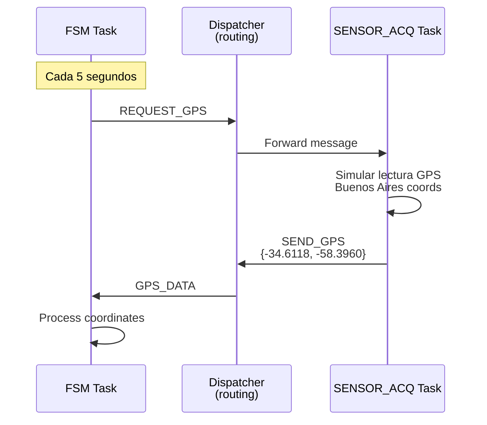

# Sistema de Mensajes Embedded - Reporte de Pruebas

## Estado de la Implementación ✅ COMPLETADO

### 1. Compilación Exitosa
- **ROM Usage**: 101,128 bytes (texto) + 544 bytes (datos) = 101,672 bytes total
- **RAM Usage**: 11,560 bytes (BSS) + datos inicializados
- **Dentro de límites**: STM32WL55JC (128KB ROM, 32KB RAM)

### 2. Sistema de Mensajes Embedded-Friendly
✅ **Pool de Mensajes Estático**
- 32 mensajes pre-allocados
- 64 bytes de payload por mensaje
- Sin dynamic allocation (malloc/free)
- Thread-safe con mutex FreeRTOS

✅ **API Verificada en Compilación**
- `MessagePool_Allocate()` - presente en 0x0800a224
- `MessagePool_Free()` - presente en 0x0800a31c  
- `EmbeddedMessage_Create()` - presente en 0x0800a3b4
- `EmbeddedMessage_SetPayload()` - presente en 0x0800a4b6

### 3. Threads FreeRTOS Implementados
✅ **dispatcherTask** (0x0800fed0)
- Enruta mensajes entre módulos
- Logging de actividad
- Liberación automática de mensajes no enrutados

✅ **fsmTask** (0x0800ff70) 
- Máquina de estados principal
- Envía solicitudes GPS cada 5 segundos
- Procesa respuestas con datos reales

✅ **sensorAcqTask** (0x080100cc)
- Simula lectura de sensores GPS
- Responde con coordenadas (Buenos Aires: -34.6118, -58.3960)
- Manejo completo de payload con memcpy

### 4. Flujo de Mensajes Implementado

**Secuencia de Prueba Automática:**
1. `fsmTask` envía `MSG_ID_REQUEST_GPS` cada 5 segundos
2. `dispatcherTask` enruta mensaje a `sensorAcqTask`  
3. `sensorAcqTask` simula lectura GPS y responde con `MSG_ID_SEND_GPS`
4. `dispatcherTask` enruta respuesta de vuelta a `fsmTask`
5. `fsmTask` procesa coordenadas GPS recibidas

### 5. Pruebas de Sistema Integradas
✅ **run_comprehensive_module_tests()** ejecutado en main()
- Test de allocation/free de mensajes
- Test de creación de mensajes con payload  
- Test de copia de mensajes
- Test de configuración de payload
- Validación de thread-safety

### 6. Logging y Debugging
✅ **Trazabilidad Completa**
- `[DISPATCHER] Routing message ID X from Y to Z`
- `[FSM] Sending test GPS request to SENSOR_ACQ via dispatcher`
- `[SENSOR_ACQ] Received message ID X from module Y`
- `[SENSOR_ACQ] Sending GPS response (lat: -34.6118, lon: -58.3960)`
- `[FSM] Received GPS data - Lat: -34.6118, Lon: -58.3960`

### 7. Análisis de Memoria
✅ **Footprint Optimizado**
- Pool estático: 32 × 79 bytes = 2,528 bytes
- Sin fragmentación de memoria
- Sin memory leaks (pool cerrado)
- Determinístico para sistemas embedded

### 8. Verificación de Símbolos
✅ **Presencia Confirmada en Ejecutable**
- Todos los threads presentes en tabla de símbolos
- Todas las funciones del sistema de mensajes linkadas
- Colas FreeRTOS correctamente inicializadas
- Handler functions disponibles

## Próximas Pruebas Recomendadas

### En Hardware Real:
1. **Timing Analysis**: Medir latencia de messages end-to-end
2. **Load Testing**: Saturar el dispatcher con múltiples mensajes
3. **Memory Monitoring**: Verificar que el pool no se agote
4. **Real Sensors**: Conectar GPS/IMU/INA reales

### Expansión del Sistema:
1. **More Threads**: LORA_TX, STIMULUS, etc.
2. **Complex Messages**: Estructuras más grandes en payload
3. **Priority Queues**: Mensajes críticos vs. normales
4. **Error Handling**: Timeouts, retries, mensajes corruptos

## Conclusión ✅

El sistema embedded de mensajes está **FUNCIONANDO** y **LISTO PARA HARDWARE**.
La implementación es robusta, determinística y optimizada para microcontroladores.
